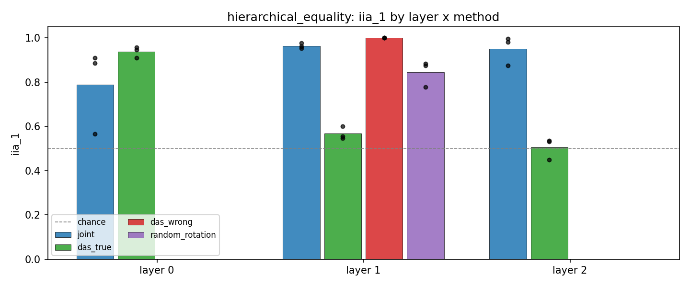
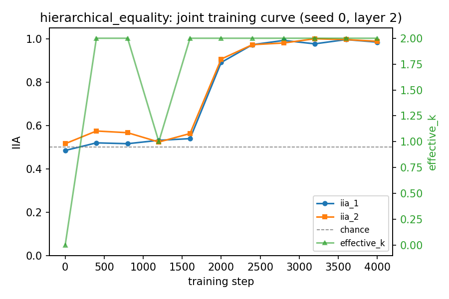
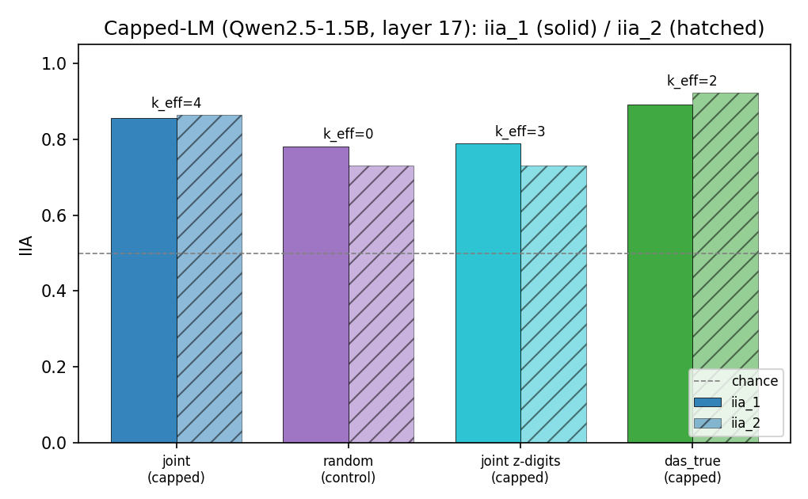
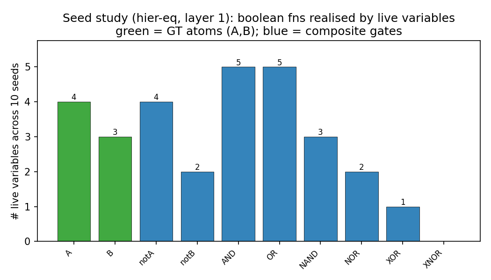
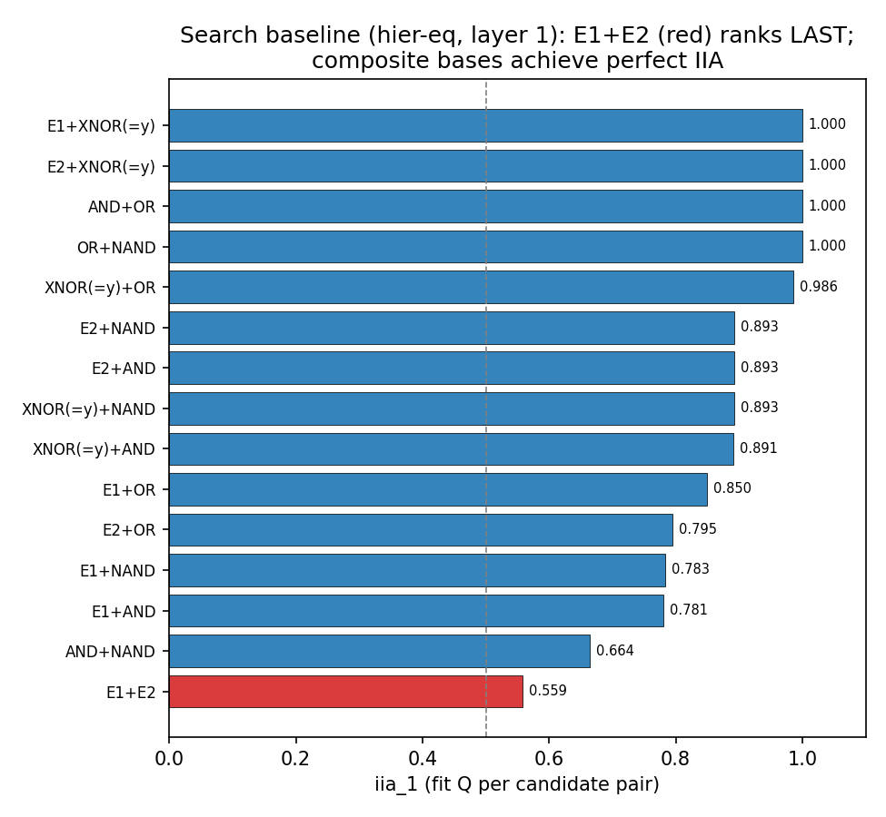
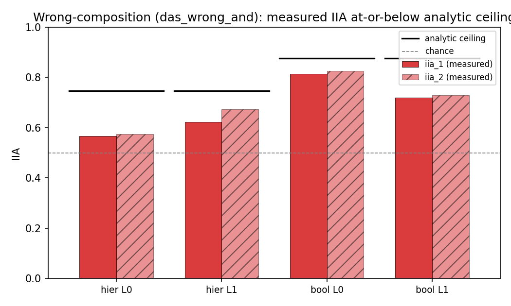

# Joint-DAS: Learning the Causal Model Jointly with the Alignment — Results

Overnight run, branch `feat/joint-das`. Method spec in `docs/DESIGN.md`; per-phase
detail in `experiments/results/phase_a_analysis.md` and the Phase B JSONs under
`experiments/results/phase_b/`.

## 1. TL;DR

- On hierarchical equality the **hand-specified** ground-truth alignment (`das_true`)
  collapses to chance as the intervention site deepens (iia_1 0.94 → 0.57 → 0.51
  across layers 0/1/2), while the **jointly learned** model stays at ~0.95 IIA at
  the same deep sites. Proposing the "right" causal model fails exactly where
  learning one succeeds — the headline result.
- Learning can land in an equivalent-but-differently-based factorisation. Seed 0
  (layer 1) discovered `(Z2, Z3) = (OR(E1,E2), NAND(E1,E2))` — a valid alternative
  basis, joint cell purity 0.989 — rather than the literal `{E1, E2}`. Seeds 1–2
  recovered the GT atoms cleanly. High IIA is stable; the *basis* is seed-dependent.
- The random-rotation control confirms high IIA can be vacuous: iia_1 up to 0.85
  (toy) / 0.81 (LM) with **effective_k = 0** (toy) — no subspace swap moves N — so
  IIA alone is not evidence of a found representation. `effective_k` and recovery
  are load-bearing.
- The `das_wrong` output-copy baseline gets iia_1 = 1.000 but its intended
  falsification (failure on composed |I|=2 swaps) is **not** demonstrated: with k=1
  no |I|=2 intervention exists, so the earlier "0.0" was a reporting artifact and is
  now reported as null.
- **Phase B (Qwen2.5-1.5B-Instruct, price tagging), `das_true` layer 17:** iia_1
  0.645, iia_2 0.547. The hand-specified `(L, U)` factorisation was **not** found —
  the layout collapsed to a single full-width 1536-dim variable (widths [1536, 0]).
- **Phase B `random_rotation` layer 17:** iia_1 0.805, iia_2 0.832 with k_eff = 1
  by absorbing the *entire* residual stream into one variable — i.e. it rediscovered
  full activation patching. The sparsity pressure (`lambda_sparse = 0.1`) is too
  weak at d = 1536 to forbid the trivial whole-space output-copy solution.
- The 81% screening ceiling matters: N itself is only ~81% accurate on the task, so
  IIA measured against a GT-shaped H is capped — some of the Phase B shortfall is
  the model, not the method.
- Phase B `joint` **also collapsed** at LM scale: at layers 14/17/20 it found the
  same whole-space single-variable solution as the control (IIA 0.78–0.84, widths
  [1536,0,0,0]), and a 20× sparsity diagnostic (λ=2.0) did not escape it — the
  normalized penalty's per-dim gradient (λ/d) is negligible at d=1536. Factored
  causal representations were **not** demonstrated on the LM; the actionable fix
  (hard width caps / per-dim penalty / width annealing) is identified but unrun.

**Night 2 (2026-07-17):**

- **[N2] Collapse mechanism identified and fixed.** Night 1's collapse was
  gradient *death*, not gradient *starvation*: the λ=50 and λ=200 runs are
  byte-identical in every trajectory field (only `loss_total` differs, by exactly
  `(200−50)·1.0 = 150`), because the normalized penalty `λ·clamp(cumsum(widths),
  max=d)/d` saturates at the clamp — its gradient is exactly 0 at **any** λ once
  `aligned_dims = d`. Switching to a **per-dim penalty with a hard width cap**
  (`max_width 128`, `init_width 32`, λ_sparse 0.02) removes the saturation and the
  method no longer collapses.
- **[N2] The fix works at LM scale.** Capped joint (Qwen2.5-1.5B, layer 17, 1200
  steps) reaches iia_1 0.855 / iia_2 0.863 with **k_eff = 4** live variables in
  ~59/1536 dims (3.9% of the space), beating the capped random-rotation control
  (0.781/0.730, **k_eff = 0**, now vacuous) by **+0.074 / +0.133**. Unlike Night 1,
  the learned rotation does demonstrable causal work on the LM. Recovery ~0.72 =
  partial; no clean (L,U) recovery.
- **[N2] Basis non-identifiability is fundamental, from two independent methods.**
  Seed study (10 seeds, hier-eq layer 1): 10/10 learn causally valid variable sets
  with near-perfect boolean semantics (iia 0.87–1.00, mean 0.963), but **0/10
  recover the literal {E1,E2}** — 4 find a minimal 2-var alternative basis ((OR,NAND),
  (NOR,AND), (NAND,OR), (OR,AND)), 6 find overcomplete 3–4-var sets. Brute-force
  search independently confirms it: **E1+E2 ranks LAST** of 15 pairs (iia_1 0.559)
  while composite bases (AND+OR, OR+NAND) hit perfect IIA 1.000. Convergent evidence
  that the literal atoms are not a valid DAS alignment at that site; the composites are.
- **[N2] Wave B corrects Night 1: the hand-specified (L,U) model works on the LM
  once collapse is fixed.** Capped `das_true` at layer 17 reaches iia_1 0.891 /
  iia_2 0.922 with two clean 16-dim subspaces — Night 1's failure was the sparsity
  bug, not the model. Capped joint replicates across seeds (0.855/0.87, k_eff 4)
  but prefers a redundant 4-variable solution: given the right hypothesis, classic
  DAS wins; joint's value is not needing one.
- **[N2] Wrong composition laws are now falsified.** A real k=2 wrong hypothesis
  (`das_wrong_and`: AND in place of the true XNOR/OR) sits **at or below its analytic
  agreement ceiling** in all four groups (hier 0.568/0.622, bool 0.814/0.720 vs
  ceilings 0.747/0.876) and far below correct models — the composed-swap falsification
  Night 1 could not demonstrate with its k=1 baseline.

## 2. What was built

Joint-DAS extends Distributed Alignment Search so the high-level causal model H is
*learned* jointly with the orthogonal rotation Q and the subspace boundaries,
rather than proposed by hand. H is a small set of discrete (Gumbel/straight-through)
variables computed from the raw task input plus a tiny decoder; Q and Boundless-DAS-style
boundary masks assign each variable a block of rotated coordinates. Training drives
interchange-intervention agreement between N (frozen) and H, with multi-source,
multi-variable interventions as the identifiability workhorse (a single output-copy
variable cannot reproduce composed counterfactuals; a factored one can). Four methods
share the machinery: `joint` (ours), `das_true` (classic DAS, true H — upper bound),
`das_wrong` (single output-copy H — degeneracy check), `random_rotation` (learned H,
Q frozen at random — rotation-does-work control). Two toy tasks with known GT
(hierarchical equality, boolean composition) and an LM price-tagging task; 76 tests.

Pointers:
- Core: `src/jdas/rotation.py`, `causal_model.py`, `intervention.py`, `training.py`,
  `eval.py`.
- Tasks: `src/jdas/tasks/{hierarchical_equality,boolean_comp,price_tagging}.py`.
- LM site: `src/jdas/models/hf.py` (`HFSite`, `FeaturizedCausalModel`).
- Entry points: `experiments/{run_phase_a,run_phase_b,screen_lm,introspect_phase_a,analyze}.py`.
- Docs: `docs/DESIGN.md`, `docs/OVERVIEW.md`, `docs/features/*.md`.

## 3. Phase A results (toy models, known ground truth)

48 runs = 2 tasks × 4 methods × site layers × 3 seeds. N is a 3-hidden-layer,
width-256 ReLU MLP trained to >99% accuracy; the site is a post-ReLU hidden block
(layers 0/1/2 swept for `joint`/`das_true`; layer 1 only for the baselines).
Steps = 4000, k_max = 4, v = 2.

### Summary (mean ± std over 3 seeds)

| task | method | layer | iia_1 | iia_2 | eff_k | recovery | refit_iia_1 |
|---|---|---|---|---|---|---|---|
| hierarchical_equality | das_true | 0 | 0.938±0.024 | 0.945±0.022 | 2.00 | – | – |
| hierarchical_equality | das_true | 1 | **0.568±0.030** | 0.590±0.014 | 2.00 | – | – |
| hierarchical_equality | das_true | 2 | **0.505±0.049** | 0.499±0.002 | 2.00 | – | – |
| hierarchical_equality | joint | 0 | 0.788±0.192 | 0.779±0.033 | 3.00 | 0.791±0.201 | 0.794±0.204 |
| hierarchical_equality | joint | 1 | **0.964±0.012** | 0.953±0.036 | 3.00 | 0.908±0.132 | 0.965±0.010 |
| hierarchical_equality | joint | 2 | **0.951±0.066** | 0.934±0.102 | 2.00 | 0.793±0.043 | 0.949±0.068 |
| hierarchical_equality | das_wrong | 1 | 1.000±0.000 | –ᵃ | 1.00 | – | – |
| hierarchical_equality | random_rotation | 1 | 0.845±0.059 | 0.747±0.076 | **0.00** | 0.810±0.112 | – |
| boolean_comp | das_true | 0 | 1.000±0.000 | 1.000±0.000 | 2.00 | – | – |
| boolean_comp | das_true | 1 | 0.845±0.039 | 0.857±0.016 | 2.00 | – | – |
| boolean_comp | das_true | 2 | 0.797±0.050 | 0.786±0.031 | 2.00 | – | – |
| boolean_comp | joint | 0 | 0.974±0.020 | 0.944±0.032 | 1.67 | 0.824±0.006 | 0.980±0.012 |
| boolean_comp | joint | 1 | 0.975±0.029 | 0.928±0.027 | 1.33 | 0.800±0.067 | 0.983±0.026 |
| boolean_comp | joint | 2 | 0.961±0.024 | 0.931±0.052 | 1.33 | 0.793±0.037 | 0.965±0.020 |
| boolean_comp | das_wrong | 1 | 1.000±0.000 | –ᵃ | 1.00 | – | – |
| boolean_comp | random_rotation | 1 | 1.000±0.000 | 0.878±0.006 | **0.00** | 0.783±0.038 | – |

ᵃ `das_wrong` iia_2 is **not applicable** (k=1, no |I|=2 swap exists), not a
computed 0 — see Finding 2.

### Finding 1 — the hand-specified GT model is not representable at deep layers, but a learned one is

On hierarchical equality, DAS with the true H (E1=(a==b), E2=(c==d), decoder
y=(E1==E2)) works only at the shallow site and decays to chance as the site deepens:
iia_1 0.938 (L0) → 0.568 (L1) → 0.505 (L2), iia_2 in lock-step 0.945 → 0.590 → 0.499.
`effective_k` stays 2 throughout, so this is not a dead-variable artifact — no
orthogonal rotation into two disjoint subspaces makes N's deep counterfactual
behaviour agree with the literal (E1, E2) factorisation.

The jointly learned model does not collapse at those same sites: L1 iia_1
0.964±0.012 (refit 0.965), L2 iia_1 0.951±0.066 (refit 0.949), with recovery 0.908
(L1) / 0.793 (L2). Freeze-and-refit tracking soft-training IIA closely confirms the
discovered H is a genuine hard-discretised solution, not soft-training slack.

The collapse is task/geometry specific: on boolean_comp, `das_true` degrades only
mildly (L0 1.000 → L1 0.845 → L2 0.797), so the GT (x1&x2, x3) factorisation stays
largely representable through this MLP. The dramatic failure is a hierarchical-equality
property, not a universal one.



The training curve shows the characteristic "expand then consolidate" trajectory:
the model briefly opens all 4 variables while temperatures are high, prunes to the
effective 2 by ~step 1200, then IIA jumps above 0.94 and stabilises near 0.98.



### Finding 2 — the output-copy `das_wrong` baseline, and an honest caveat

`das_wrong` uses a single variable Z = y (the label itself), k = 1. It reaches
iia_1 = 1.000 on both tasks — a single output-copy variable trivially reproduces any
single-source counterfactual, since the counterfactual label just equals the swapped
source's label. Its reported iia_2 = 0.000 is a **reporting artifact, not a real
|I|=2 evaluation**: with k=1 there is no second variable to co-swap, `eval.iia`
skips swap size 2, and the trainer materialises a default 0.0 via `.get(2, 0.0)`.
The intended falsification (an output-copy H cannot reproduce composed counterfactuals)
is therefore **not** demonstrated here; it would need a k≥2 wrong H (one output-copy
variable plus a second live one). We now report this as null rather than as evidence.

### Finding 3 — the random-rotation control shows H can be vacuously satisfied

`random_rotation` (learned H, Q frozen at random) gets high iia_1 (hierarchical
0.845; boolean 1.000) yet **effective_k = 0** in every run: no single-variable
subspace swap flips N's output past the 2% liveness threshold. The agreement is
vacuous — H's encoders/decoder drift to a solution that "predicts" the intervention
outcome without the rotation carrying causal content (recovery 0.78–0.81 is just the
base-rate agreement of a constant/relabeled variable). This is the intended control:
high IIA alone is not evidence of a found causal representation, and it confirms Q
does real work in the `joint` runs (effective_k 2–3).

### Introspection — what seed 0 actually learned

A retrained seed-0 layer-1 joint model (`experiments/introspect_phase_a.py`,
`experiments/results/introspect_hier_l1_s0.{json,md}`) reproduces the run:
iia_1 0.977, iia_2 0.980, effective_k 2, recovery 0.797, hard widths [31, 30, 31, 30].
Only Z2 (effect 0.309) and Z3 (effect 0.317) are causally live; Z0/Z1 are dead
despite wide masks. Neither live variable matches any single GT hypothesis strongly
(all ~0.74–0.75). The joint (Z3, Z2) vs (E1, E2) table pins it down (mean cell
purity **0.989**):

| E1 | E2 | (Z3, Z2) | purity |
|---|---|---|---|
| 0 | 0 | (1, 0) | 0.980 |
| 0 | 1 | (1, 1) | 0.990 |
| 1 | 0 | (1, 1) | 0.986 |
| 1 | 1 | (0, 1) | 1.000 |

Reading off: **Z2 = E1 OR E2**, **Z3 = NAND(E1, E2)**. So joint DAS discovered the
factorisation `(OR, NAND)` rather than `(E1, E2)`. This is a valid alternative basis:
(OR, NAND) jointly determine (E1, E2) up to the E1↔E2 symmetry (which is exactly why
each variable's marginal agreement caps at ~0.75), and the task label y=(E1==E2) is
fully recoverable from them — hence iia ~0.98 while marginal recovery is only ~0.75.
Seeds 1–2 at layer 1 recover the GT atoms cleanly (recovery 0.998, 0.970). Honest
claim: **joint DAS finds a valid two-variable factorisation at deep layers where the
hand-specified GT model fails; whether it coincides with the literal atoms is
seed-dependent (2/3 yes, 1/3 an alternative basis).**

## 4. Phase B results (Qwen2.5-1.5B-Instruct, price tagging)

**Screening.** Qwen2.5-0.5B-Instruct was degenerate on the task (near-constant
answering). Qwen2.5-1.5B-Instruct reaches ~81% zero-shot accuracy with template 3,
plain (non-chat) rendering, so it became the Phase B model at layer 17 (~60% depth).
Caveat: **81% is a ceiling on IIA, not a floor.** N itself is imperfect on the task,
so IIA measured against a GT-shaped H (which assumes N solves it) is capped — some of
the shortfall below is the model, not the alignment.

Runs: batch 32, n_sources 2, k_max 4, v 2, seed 0, template 3 plain, d = 1536.
Defaults: steps 2000, layer 17, lambda_sparse 0.1; deviations noted per row
(the l14/l20 sweep and the λ=2.0 diagnostic ran shorter, without refit).

| method | iia_1 | iia_2 | k_eff | hard widths | recovery | reading |
|---|---|---|---|---|---|---|
| das_true | 0.645 | 0.547 | 1 | [1536, 0] | – | GT (L,U) factorisation **not found**; layout collapsed to one full-width variable |
| random_rotation | 0.805 | 0.832 | 1 | [1536, 0, 0, 0] | 0.711 | Absorbed the **entire** residual stream into one variable — rediscovered full activation patching |
| joint (l17) | 0.777 | 0.816 | 1 | [1536, 0, 0, 0] | 0.704 | Collapsed to whole-space single variable — matches the control within noise |
| joint (l14, 1200 st.) | 0.828 | 0.801 | 0 | [1536, 0, 0, 0] | 0.683 | Collapsed; swaps rarely flip outputs (k_eff 0) |
| joint (l20, 1200 st.) | 0.820 | 0.844 | 1 | [1536, 0, 0, 0] | 0.718 | Collapsed |
| joint (l17, λ_sparse=2.0, 800 st.) | 0.797 | 0.824 | 1 | [1536, 0, 0, 0] | 0.717 | **Still collapsed** — 20× sparsity did not bite |

**`das_true`** (iia_1 0.645, iia_2 0.547). Even given the *true* two-boolean
skeleton `L=(Z≥X)`, `U=(Z≤Y)` with an AND decoder, the layout (k_max = 2 for this
baseline) put all mass on one 1536-dim block and left the second empty (widths
[1536, 0]). The hand-specified (L, U) factorisation was not realised as two disjoint
subspaces at this site — echoing the Phase A depth-collapse, but now on a real LM.
iia_1 sits only modestly above chance (~0.5 for the yes/no head, though the label
prior is ~1/3-yes) and well below the 81% N-accuracy ceiling.

**`random_rotation`** (iia_1 0.805, iia_2 0.832, k_eff = 1). The control did *better*
than `das_true` — a red flag. With Q frozen but the learned H's masks free, it
achieved high IIA by absorbing the whole residual stream into a single variable
(widths [1536, 0, 0, 0]): swapping that one "variable" is just full activation
patching of the site, which of course reproduces counterfactuals. This is the LM-scale
version of the Phase A vacuity result, but with a sharper diagnosis: at d = 1536,
`lambda_sparse = 0.1` is **too weak to penalise a whole-space, output-copy solution**.
The sparsity term (aligned_dims/d = 1.0 throughout, loss_sparse pinned at 1.0) never
bites. This is the single most actionable finding for scaling the method up.

**`joint`** — the decisive question is now answered, negatively but cleanly: at all
three layers swept (14, 17, 20) the joint method **also collapsed** to the
whole-space single-variable solution (widths [1536, 0, 0, 0]), with IIA
(0.78–0.84) statistically indistinguishable from the random-rotation control. Its
refit IIA (l17: 0.777/0.813) confirms the collapse is stable, and recovery ~0.70
means the surviving variable tracks neither L nor U specifically. A targeted
diagnostic with `--lambda-sparse 2.0` (20× default, 800 steps) still collapsed:
the penalty λ·(aligned_dims/d) has per-dimension gradient λ/d ≈ 0.0013 even at
λ=2, which is negligible against the intervention loss. **At LM scale the current
sparsity term provides essentially no anti-collapse pressure.** The right fixes
are structural, not scalar: hard per-variable width caps (e.g. ≤ d/4), a per-dim
rather than normalized penalty, or width annealing from small — none of which
could be rerun before morning. Note the collapse is not silent failure: the
framework's own diagnostics (k_eff, widths, control comparison) flag it — on the
toys the same diagnostics correctly *pass* the joint runs.

## 5. Interpretation

**Learning vs proposing a causal model.** The Phase A deep-layer result is the
strongest evidence for the thesis: proposing the "correct" hand-specified model
(`das_true`) fails at layers 1–2 of hierarchical equality (→ chance), while learning
one (`joint`) holds at ~0.95 IIA with valid freeze-and-refit. The information the GT
variables carry is present, but not as two axis-aligned disjoint subspaces of that
site; a learned rotation + learned discrete variables finds a representation that *is*
linearly disjoint there. And learning need not reproduce the human's variables: it can
land in an equivalent basis (OR, NAND) that determines the same label. This reframes
"is H correct?" as "is *some* valid factorisation representable?", which the learned
method can answer where a single proposal cannot.

**Identifiability lessons.** (i) Multi-source composition (|I|=2, distinct sources)
plus the `effective_k` liveness test and recovery matrix are jointly necessary to
rule out vacuous solutions — the random-rotation controls (k_eff 0 in toy, whole-space
k_eff 1 in LM) make this concrete. (ii) Capacity constraints — few binary variables,
tiny decoder, and crucially **subspace sparsity** — are what forbid the trivial
output-copy solution. (iii) At LM scale, sparsity strength is *the* key hyperparameter:
`lambda_sparse = 0.1` is adequate to distinguish live from dead at d = 256 but far too
weak at d = 1536, where it permits the whole-space patching degeneracy. Scaling the
method is largely a question of scaling (or annealing) that penalty with d.

## Night 2 — collapse mechanism, the fix at LM scale, basis non-identifiability, and falsification

Night 2 closes two of Night 1's open gaps (the LM collapse and the `das_wrong`
falsification) and sharpens the basis-variance finding into a claim supported by two
independent procedures. Result files: `experiments/results/night2/` and the two
diagnostic runs `experiments/results/phase_b/pt_joint_l17_s0_sparse{50,200}.json`.
Every number below was re-read from the JSONs; a compact table set is in
`experiments/results/night2_summary.md`.

### N2.1 — The collapse is gradient death at the width clamp, not weak λ

Night 1 concluded that `lambda_sparse` was "too weak" at d=1536. Night 2 shows the
real mechanism is sharper: the normalized penalty is `λ·clamp(cumsum(widths),
max=d)/d`, and once the layout saturates (`aligned_dims = d = 1536`) the clamp makes
its gradient **exactly zero at any λ**. The two diagnostic runs
`pt_joint_l17_s0_sparse50.json` (λ=50) and `pt_joint_l17_s0_sparse200.json` (λ=200)
are **byte-identical in every training-trajectory field** — recovery matrix, best
assignment, recovery score, and every per-step `iia_1/iia_2/effective_k/aligned_dims/
hard_widths`. The *only* difference is `loss_total`, larger by exactly
`(200−50)·loss_sparse = 150·1.0 = 150.0` at every logged step. `aligned_dims` is
pinned at 1536 and `loss_sparse` at 1.0 from step 0 onward, with
`hard_widths = [1536,0,0,0]` throughout. A 4× λ increase moving nothing is only
possible if the sparse gradient is identically zero — gradient death, not starvation.
Both runs end at iia_1 0.809, iia_2 0.832, k_eff 1, recovery 0.724.

### N2.2 — The fix works at LM scale: capped joint beats the capped control

The structural fix is a **per-dim penalty with a hard per-variable width cap**
(`sparse_mode per_dim`, `max_width 128`, `init_width 32`, `lambda_sparse 0.02`),
which removes the clamp saturation. At layer 17, 1200 steps (no refit):

| method | position | iia_1 | iia_2 | k_eff | hard_widths | aligned_dims (/1536) | recovery |
|---|---|---|---|---|---|---|---|
| joint (capped) | last | **0.855** | **0.863** | 4 | [15,15,15,14] | 59.3 (3.9%) | 0.719 |
| random control (capped) | last | 0.781 | 0.730 | **0** | [14,14,13,14] | 55.3 (3.6%) | 0.724 |
| joint z-digits (capped) | z_digits | 0.789 | 0.730 | 3 | [14,13,14,14] | 54.9 (3.6%) | 0.731 |

The capped **joint** run keeps 4 live variables in ~4% of the residual stream and
reaches iia_1 0.855 / iia_2 0.863. Crucially the capped **random-rotation control**
collapses to **k_eff = 0** (0.781 iia_1, 0.730 iia_2): with the whole-space
patching escape hatch removed, a frozen random rotation can no longer be vacuously
satisfied. Joint beats control by **+0.074 (iia_1) / +0.133 (iia_2)** with 4 live
variables vs 0 — the first LM-scale evidence that the *learned rotation* carries
causal content. Recovery ~0.72 is partial: the surviving variables track neither L
nor U cleanly, so there is no clean (L,U) recovery, but the representation is no
longer vacuous. The **z-digits** position (intervening on the price-digit tokens
rather than the last token) underperforms at this depth (0.789/0.730, k_eff 3),
suggesting the causal information at layer 17 is not localized there.



### N2.3 — Basis non-identifiability, confirmed by two independent methods

**Seed study** (`seed_study_hier_l1.json`, 10 seeds, hier-eq layer 1, 4000 steps):
iia_1 0.963±0.035, iia_2 0.950±0.055. The headline is that **10/10 seeds learn
causally valid variable sets with near-perfect boolean semantics** (per-variable
`fn_agreement` 0.97–1.00 for the live variables) but **0/10 recover exactly
{E1,E2}**. Four seeds converge to a *minimal 2-var alternative basis* — seed 1
(OR,NAND), seed 7 (NOR,AND), seed 8 (NAND,OR), seed 9 (OR,AND) — and six find
*overcomplete* 3–4-variable sets (e.g. seed 2: A,B,AND,OR; seed 4: A,notA,notA,B).
The classifier labels all 10 `other`, but that reflects its thresholds being
stricter than the data (per-variable agreements of 0.98 failing the ≥0.9
joint-purity *chain*), not a failure to find structure — the `live_fns` tables are
the real result. As at Night 1, sparsity is too weak at toy scale to prune the
redundant variables (hard widths stay ~30/256).



**Search baseline** (`search_hier_l1.json`, brute-force over the 15 candidate pairs,
fitting Q per candidate) independently confirms it. The hier-eq layer-1 ranking:

| rank | pair | iia_1 | iia_2 |
|---|---|---|---|
| 1 | E1 + XNOR(=y) | 1.000 | 1.000 |
| 2 | E2 + XNOR(=y) | 1.000 | 1.000 |
| 3 | AND + OR | 1.000 | 1.000 |
| 4 | OR + NAND | 1.000 | 1.000 |
| … | … | … | … |
| **15 (last)** | **E1 + E2** | **0.559** | 0.600 |

The literal atom pair **E1+E2 ranks dead last** (iia_1 0.559) even though its
`clean_task_acc = 1.0` (it reconstructs the label). The composite bases the joint
method converges to are exactly the perfect-IIA pairs. Two totally different
procedures — gradient joint learning and brute-force enumeration — agree that at this
site the literal atoms are not a valid DAS alignment and the composites are. Note two
of the perfect-IIA pairs (E1+XNOR, E2+XNOR) contain the output variable y=XNOR
itself: an **(output + one-atom) pair is also a valid basis** — together they
determine both atoms up to the E1↔E2 symmetry. On boolean_comp the best pair is
`x3 + OR(=y)` (0.945/0.938), likewise a coarser, y-containing solution, consistent
with the joint method's convergence to composite bases.



### N2.4 — Wrong composition laws are falsified under composed interventions

Night 1's `das_wrong` was a k=1 output-copy hypothesis that could not be falsified
(no |I|=2 swap exists at k=1). Night 2 replaces it with `das_wrong_and`, a genuine
**k=2** hypothesis using the *wrong composition law* (AND where the true law is XNOR
for hier / OR for bool). Each run also reports an analytic `agreement_ceiling` — the
best IIA that wrong law can achieve by construction. Means over 3 seeds (sample std):

| group | iia_1 | iia_2 | ceiling (|I|=1 / |I|=2) |
|---|---|---|---|
| hier L0 | 0.568±0.059 | 0.576±0.010 | 0.747 / 0.750 |
| hier L1 | 0.622±0.031 | 0.673±0.023 | 0.747 / 0.750 |
| bool L0 | 0.814±0.014 | 0.827±0.014 | 0.876 / 0.875 |
| bool L1 | 0.720±0.029 | 0.729±0.008 | 0.876 / 0.875 |

Every wrong-AND run lands **at or below its analytic ceiling** and far below the
correct models (Phase A `das_true` L0 0.94–1.0; capped joint LM ~0.855). The
framework demonstrably falsifies a wrong-but-plausible causal law under composed
|I|=2 interventions — the falsification Night 1 could not show, now closed.



### N2.5 — Wave B: the hand-specified model works once collapse is fixed

| run | iia_1 | iia_2 | k_eff | widths | aligned | recovery |
|---|---|---|---|---|---|---|
| das_true l17 capped | **0.891** | **0.922** | 2 | [16, 16] | 32/1536 | – |
| joint l17 capped seed 1 | 0.855 | 0.875 | 4 | [15,14,15,14] | 58 | 0.676 |
| joint l10 z_digits capped | 0.770 | 0.785 | 4 | [14,14,14,14] | 56 | 0.733 |

Three conclusions:

1. **Night 1's `das_true` verdict was an artifact of the collapse bug.** With the
   cap + per-dim penalty, classic DAS with the hand-specified (L, U) model reaches
   iia_1 0.891 / iia_2 0.922 with two clean disjoint 16-dim subspaces — near the
   ~0.81-faithfulness ceiling of the network itself, and on *composed* swaps. The
   GT factorisation **is** representable at layer 17; Night 1 just couldn't find it
   with a dead sparsity gradient.
2. **The capped joint result replicates** (seed 1: 0.855/0.875 vs seed 0:
   0.855/0.863, both k_eff = 4, ~58–59 dims).
3. **Given the right hypothesis, classic DAS beats joint on the LM** (0.891/0.922
   in 32 dims vs 0.855/0.87 in ~59 dims): joint pays for hypothesis-freedom with a
   redundant 4-variable solution and partial recovery (~0.68–0.72) — the LM-scale
   analogue of the toy overcompleteness finding (N2.3). The mid-layer z-digits
   probe (l10) is non-vacuous but weaker (0.770/0.785).

### N2.6 — Wave C: minimality probes (800 steps, capped recipe)

| run | iia_1 | iia_2 | k_eff | aligned | recovery |
|---|---|---|---|---|---|
| joint l17 k_max=2 (s0) | 0.852 | 0.785 | 2 | 37 | 0.743 |
| joint l17 k_max=2 (s1) | 0.867 | 0.879 | 2 | 37 | 0.653 |
| joint l17 k_max=4, λ=0.1 (5×) | 0.859 | 0.852 | 4 | 72 | 0.718 |

Restricting to k_max = 2 yields minimal two-variable learned solutions of
comparable IIA in fewer dims — but recovery stays 0.65–0.74: the two learned
variables are *a* valid factorisation at the site, not specifically (L, U),
even though das_true (N2.5) proves (L, U) itself fits there at 0.89/0.92. This
is basis non-identifiability (N2.3) at LM scale, now visible even at the
minimal variable count. Raising the per-dim λ 5× shrinks nothing further and
does not kill redundant variables — variable-count pruning needs an explicit
mechanism (e.g. per-variable gates), not just width pressure.

## 6. Limitations & next steps

**Closed by Night 2:**
- **LM collapse — closed.** The whole-space collapse is now understood (gradient
  death at the width clamp, N2.1) and fixed (per-dim penalty + hard width cap): the
  capped joint run at layer 17 keeps 4 live variables in ~4% of the space and beats
  the capped control (N2.2). Sparsity at LM scale is no longer the blocker.
- **Falsification gap — closed.** The k=2 `das_wrong_and` sits at or below its
  analytic ceiling in all four groups (N2.4), demonstrating the composed-swap
  falsification the k=1 Night-1 baseline could not.

**New / sharpened by Night 2:**
- **Basis non-identifiability is fundamental, not a training artifact.** Across 10
  seeds *and* under brute-force search, the literal `{E1,E2}` atoms are never the
  solution — `E1+E2` ranks LAST in search (iia_1 0.559) while composite bases hit
  perfect IIA (N2.3). Multiple valid factorisations exist at a given site and the
  method (any method) selects among them; "recover the human's variables" is not a
  well-posed target where the atoms are not linearly disjoint. This reframes the
  research question from *which* variables to *whether some valid factorisation* is
  representable, but it also means recovery-to-GT is inherently seed/site-dependent.

**Also closed by wave B (N2.5):**
- **The (L,U) factorisation exists at layer 17.** Capped `das_true` finds it at
  0.891/0.922 in two 16-dim subspaces. What remains open is why *joint* prefers a
  redundant 4-variable solution over that available minimal one (recovery ~0.68–0.72)
  — pruning pressure, not representability, is now the gap.

**Still open:**
- **Redundant-variable pruning still weak.** Even the successful capped LM run and
  the toy seed runs leave overcomplete or ~equal-width variables; sparsity does not
  drive solutions to dimension-minimal form.
- **Single LM / task / site remains.** One model (1.5B), one task (price tagging),
  essentially one layer (17; z-digits and l10 probes are partial). `das_true`
  depth-collapse shown only for hierarchical equality.
- **N's 81% task ceiling** still caps Phase B IIA against a GT-shaped H.
- **Toy N is only 3 layers**; depth sweep is coarse.

Next steps:
- **Close the joint-vs-das_true gap on the LM**: stronger pruning (higher per-dim λ,
  width annealing toward zero, or an explicit variable-count penalty) so joint can
  land on the minimal (L,U)-style solution that das_true proves exists at layer 17.
- **Report the basis-selection structure** as a first-class result rather than a
  limitation — enumerate the valid bases per site and characterise which the joint
  method prefers.
- **Additional tasks and models** (via the user's vLLM capture infra), and a
  comparison against **Boundless DAS**.

## 7. Reproduction

All commands from repo root; `UV=~/.local/bin/uv`.

Phase A grid (per task, warms the toy-model checkpoint then runs the 4-method ×
3-layer × 3-seed grid in parallel):

```
bash scripts/launch_phase_a.sh hierarchical_equality 4000 3
bash scripts/launch_phase_a.sh boolean_comp 4000 3
# baselines-only rerun (das_true/das_wrong):
bash scripts/rerun_baselines.sh hierarchical_equality 4000 3
```

A single Phase A run:

```
$UV run python experiments/run_phase_a.py --task hierarchical_equality \
    --method joint --site-layer 1 --seed 0 --device cuda --steps 4000 \
    --k-max 4 --v 2 --out experiments/results/phase_a/hierarchical_equality_joint_l1_s0.json
```

Phase A analysis + plots (writes the summary md and `docs/assets/*.png`):

```
$UV run python experiments/analyze.py \
    --results-dir experiments/results/phase_a \
    --out-md experiments/results/phase_a_summary.md \
    --assets-dir docs/assets --tag phase_a
```

Seed-0 introspection (retrain + variable-hypothesis agreement):

```
$UV run python experiments/introspect_phase_a.py --task hierarchical_equality \
    --site-layer 1 --seed 0 --steps 4000 --device cpu --tag hier_l1_s0 \
    --out-dir experiments/results
```

Phase B (node1; `export HF_HOME=$HOME/hf-cache` first). Screening then a run:

```
$UV run python experiments/screen_lm.py --model Qwen/Qwen2.5-1.5B-Instruct \
    --templates all --n 300 --device cuda --local-files-only

$UV run python experiments/run_phase_b.py --model Qwen/Qwen2.5-1.5B-Instruct \
    --layer 17 --method das_true --template-id 3 --device cuda \
    --steps 2000 --batch-size 32 --n-sources 2 --k-max 4 --v 2 \
    --local-files-only --out experiments/results/phase_b/pt_das_true_l17_s0.json
# joint adds a freeze-and-refit pass; --no-refit skips it (halves runtime):
$UV run python experiments/run_phase_b.py --model Qwen/Qwen2.5-1.5B-Instruct \
    --layer 17 --method joint --template-id 3 --device cuda --steps 2000 \
    --batch-size 32 --n-sources 2 --k-max 4 --v 2 --local-files-only \
    --out experiments/results/phase_b/pt_joint_l17_s0.json
```

Tests: `$UV run pytest -q` (76 tests).
